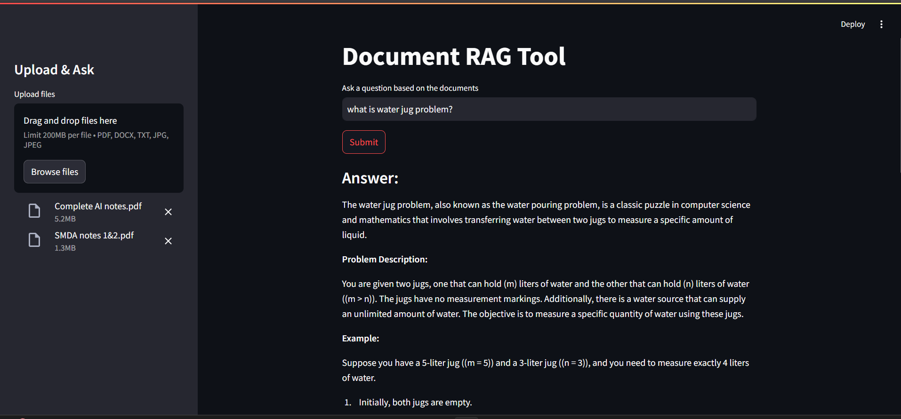
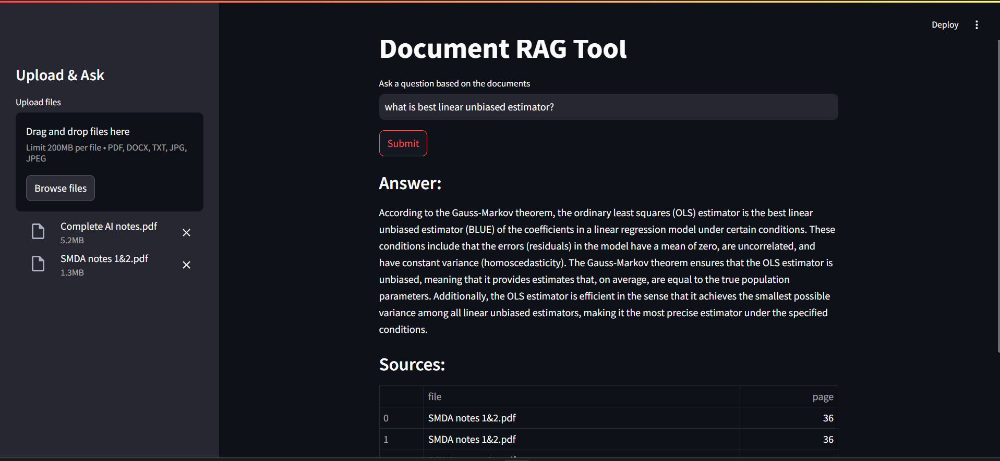

# Document RAG Tool
A full-stack Document-based Question Answering (RAG) tool that allows users to upload documents (PDF, DOCX, TXT, JPG) and ask questions about them. The system extracts text (OCR + parsing), chunks it, performs semantic search using FAISS, and uses a conversational LLM (e.g., DeepSeek, Google GenAI) to answer with source citations.

---

## 🚀 Features
- LLM-powered document Q&A
- Supports multiple file formats: PDF, DOCX, TXT, JPG
- Semantic search using FAISS
- OCR support for image-based files
- Sources cited alongside answers
- Frontend built with Streamlit
- FastAPI backend with modular service architecture

---

## Tech Stack
- **Frontend**- `Streamlit`
- **Backend**- `FastAPI`, `Fly.io ` 
- **File Parsing**- `pdfplumber`, `docx`, `pytesseract`, `Pillow`
- **OCR**- `pytesseract`
- **LLM & Embeddings**- `Gemini-2.0-flash` with `GoogleGenerativeAIEmbeddings`
- **Vector Store**- `FAISS`
- **RAG Pipelines**- `LangChain`

---

## Check it out!! 👇

---

---
You can also check out the demo video 👉[here](https://youtu.be/Mo8_ZxHoaCo)

---

## Try It
You can use the deployed web app 👉[here](https://document-rag-tool.streamlit.app/) 

>⚠️Note: It might return an `Upload failed: 502 -` error the first time you try to upload the documents; just upload again and keep the tab open...